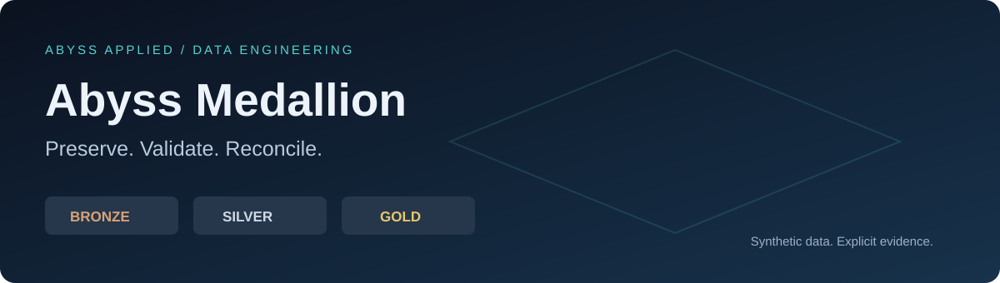
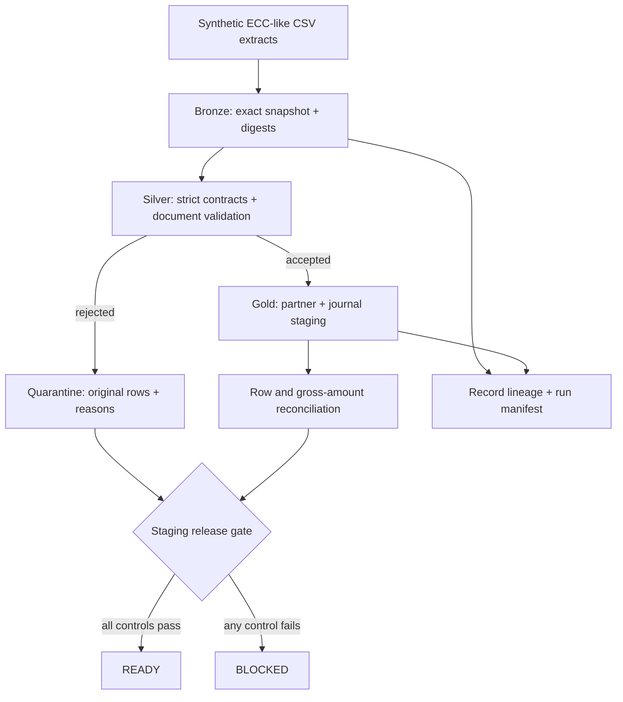

<p align="center"></p>

<p align="center"><strong>Bad source data remains visible. Reconciliation cannot waive it. Release stays blocked.</strong></p>
<p align="center">Python 3.10+ · Standard library · Offline · SQLite · MIT</p>

An executable Medallion Architecture reference using **synthetic SAP ECC-like extracts**. It preserves source data in Bronze, validates and quarantines records in Silver, and produces S/4HANA-oriented analytical staging models in Gold. Every run leaves record lineage, document decisions, financial reconciliation, and an explicit release decision.

**This is a portfolio engineering demonstration, not evidence of actual SAP migration experience.** No SAP instance, credentials, customer data, proprietary extract, CVI execution, or target-system load is involved.

## Run it in WSL

Requires Python 3.10+ and Bash. No packages, Docker, network, cloud account or API key required.

```bash
./demo
```

The command runs the tests and then the clean, defective and repaired batches. If an unzip utility drops executable permissions, use `bash demo`.

```text
CLEAN        READY     0 quarantined rows
DEFECTIVE    BLOCKED  15 quarantined rows
REPAIRED     READY     0 quarantined rows
```

Open `runs/index.html` in a browser to view the evidence reports. From WSL, `explorer.exe runs` opens the folder; double-click `index.html`. The reports are standalone HTML, with no server or external assets.

The defective batch still produces two valid journal lines. Gross financial reconciliation passes for those accepted lines, but the **batch release is denied** because 15 source rows are quarantined. The repaired extract creates a clean batch without altering the failed batch. Because repaired and clean inputs are identical, they intentionally reuse the same content-addressed run.

## What this proves

| Capability | Executable evidence |
|---|---|
| Exact raw preservation | Bronze bytes equal source bytes; SHA-256 recorded |
| Data-quality failures are visible | CSV row, raw values and all rejection reasons in `quarantine.json` |
| Accounting documents stay intact | A one-cent imbalance rejects the header and every line |
| Source rows cannot disappear | Source count = accepted count + quarantined count for every extract |
| Financial mapping conserves amounts | Gross debit and credit compared separately by company and currency |
| Release is gated | Any quarantine or failed control produces `DENY_STAGING_RELEASE` |
| Lineage is inspectable | Each partner/journal key resolves to CSV file, row, digest and mapping ID |
| Replays are stable | Identical inputs and code reuse a verified run; changed batches get new IDs |
| Corruption is detected | Edited, missing or added run files fail manifest verification |
| Review does not need infrastructure | Tests, CSV, JSON, SQLite and HTML run on a bare interpreter |

## Architecture



This implements the **layering pattern locally**, rather than simulating a distributed lakehouse with unexplained infrastructure. JSON makes artifacts easy to inspect; SQLite provides a queryable relational Gold copy. It does not implement Delta Lake, Iceberg, Spark, CDC, or a production catalog.

## ECC-like inputs and S/4HANA-oriented targets

| Input | Fields used | Illustrative target | Mapping ID |
|---|---|---|---|
| `KNA1` | `KUNNR`, `NAME1`, `LAND1` | Customer-role business partner | `BP-1` |
| `LFA1` | `LIFNR`, `NAME1`, `LAND1` | Supplier-role business partner | `BP-1` |
| `BKPF` | Company, document, fiscal year, date, currency | Journal context | `UJ-1` |
| `BSEG` | Line, account, debit/credit, document amount, partner | Signed journal staging | `UJ-1` |

IDs retain leading zeros. Customer and supplier namespaces remain separate; shared numeric IDs do not imply the same legal entity. `S` maps to a positive debit; `H` maps to a negative credit. Monetary values use integer cents, not floating point. Supported currencies are explicitly limited to USD and EUR.

**These are concept mappings, not SAP migration file schemas.** `journal_staging` is inspired by a unified journal view; it is not ACDOCA and cannot be loaded into SAP as-is. `business_partner` illustrates centralized identities; it does not perform Customer/Vendor Integration. See [mapping assumptions](docs/MAPPINGS.md) for the missing SAP semantics and validation needed in a real engagement.

## Deliberate failure injection

| Failure | Control | Consequence |
|---|---|---|
| Conflicting customer ID | `DUPLICATE_MASTER_ID` | Both master rows quarantined; dependent document rejected |
| One-cent imbalance | `UNBALANCED_DOCUMENT` | Whole accounting document quarantined |
| Unknown currency | `UNKNOWN_CURRENCY` | Whole accounting document quarantined |
| Unknown customer | `UNKNOWN_CUSTOMER` | Whole accounting document quarantined |
| Line without header | `MISSING_HEADER` | Orphan quarantined |

The tests also inject duplicate line keys, invalid monetary values, schema drift, empty extracts, HTML-sensitive values, and modified evidence. Invalid amounts are never rounded into validity. No automatic repair chooses a preferred duplicate or invents missing business data.

## Inspect or change a scenario

```bash
# Generate a source fixture and inspect/edit the CSV files.
python3 -m medallion.cli generate --scenario defective --destination scratch/extracts

# Run the edited source; blocked readiness returns exit code 2.
python3 -m medallion.cli run --source scratch/extracts --output scratch/runs

# Verify an existing run (substitute its full directory).
python3 -m medallion.cli verify runs/batches/<run-id>

# Run tests separately.
python3 -m unittest discover -s tests -v
```

`run` exits 0 for READY, 2 for BLOCKED, and 1 for input or execution errors. `demo` exits 0 only when all tests pass and its three expected outcomes occur. Its expected defective batch is part of the demonstration, not a successful release.

Example query without the SQLite CLI:

```bash
python3 - <<'PY'
from pathlib import Path
import sqlite3
for path in sorted(Path('runs/batches').glob('*/warehouse.sqlite')):
    with sqlite3.connect(path) as db:
        print(path.parent.name)
        print(db.execute('SELECT company_code, currency, debit_cents, credit_cents FROM financial_summary').fetchall())
PY
```

## Repository map

| Path | Responsibility |
|---|---|
| `demo` | One-command test and scenario runner |
| `medallion/source.py` | Deterministic fixtures and strict CSV contract |
| `medallion/quality.py` | Master, line and document validation |
| `medallion/pipeline.py` | Layer transformations, reconciliation and publication |
| `medallion/storage.py` | Canonical JSON and manifest verification |
| `medallion/report.py` | Escaped, offline HTML evidence report |
| `medallion/cli.py` | CLI and exit-code contract |
| `tests/test_pipeline.py` | Behavioral tests and hostile inputs |
| `docs/MAPPINGS.md` | SAP-oriented assumptions and boundaries |
| `docs/CONTROL-REGISTER.md` | Controls, evidence and known limitations |
| `docs/INTERVIEW.md` | Three-minute walkthrough and honest positioning |
| `.github/workflows/ci.yml` | Same demonstration on Python 3.10 and 3.12 |

## Design tradeoffs and production boundary

The batch is small and processed in memory. Bronze is preserved by append-oriented application behavior, not filesystem immutability. Artifacts are constructed in a private directory and published by rename. The manifest detects accidental/unsynchronized edits but is neither signed nor anchored externally; an actor able to rewrite both artifacts and manifest can defeat it. There is no claim of tamper-proof storage.

Lineage is record-level for business partners and journal staging. Summary lineage is derivable through journal keys, but a native catalog graph and column-level lineage are not implemented. Source conservation covers every row; monetary reconciliation covers **accepted** Silver against Gold. Rejected amounts are retained as raw values, not coerced into a misleading monetary total. No cross-currency total or FX conversion is produced.

The release decision is a local evidence artifact, not an enforced SAP write boundary. No data is sent anywhere. Production would need release-specific SAP mapping validation, approved extraction/load interfaces, secure storage, access controls, transaction/recovery design, scalable processing, CDC semantics, an external evidence anchor, deployment controls, and business-owner sign-off. See [control register](docs/CONTROL-REGISTER.md).

## Interview positioning

> I built an executable reference to show how I preserve ERP-like source data, validate complete accounting documents, model target-oriented staging, and prove conservation before release. I can demonstrate the pipeline and its failure controls. I would pair with SAP functional and migration specialists to validate the target semantics; I am not presenting this as completed SAP migration experience.

[Walkthrough and discussion points](docs/INTERVIEW.md)

## Primary references

The architectural and domain concepts were checked against primary documentation; the code remains an independent synthetic implementation.

- [Microsoft: Medallion lakehouse architecture](https://learn.microsoft.com/en-us/azure/databricks/lakehouse/medallion)
- [SAP: Business Partner Approach / Customer-Supplier Integration](https://help.sap.com/docs/SAP_S4HANA_ON-PREMISE/7b24a64d9d0941bda1afa753263d9e39/25b46c8241fd4852bf7876d87bed8fd0.html)
- [SAP: Universal Journal](https://help.sap.com/docs/SAP_S4HANA_CLOUD/0fa84c9d9c634132b7c4abb9ffdd8f06/523b8a55559ad007e10000000a44538d.html)

---

**Abyss Applied** · Infinite Solutions Applicable and Applied

[MIT](LICENSE) © 2026 Marc Alexander. SAP and related product names belong to their respective owners. No affiliation or certification is implied.
